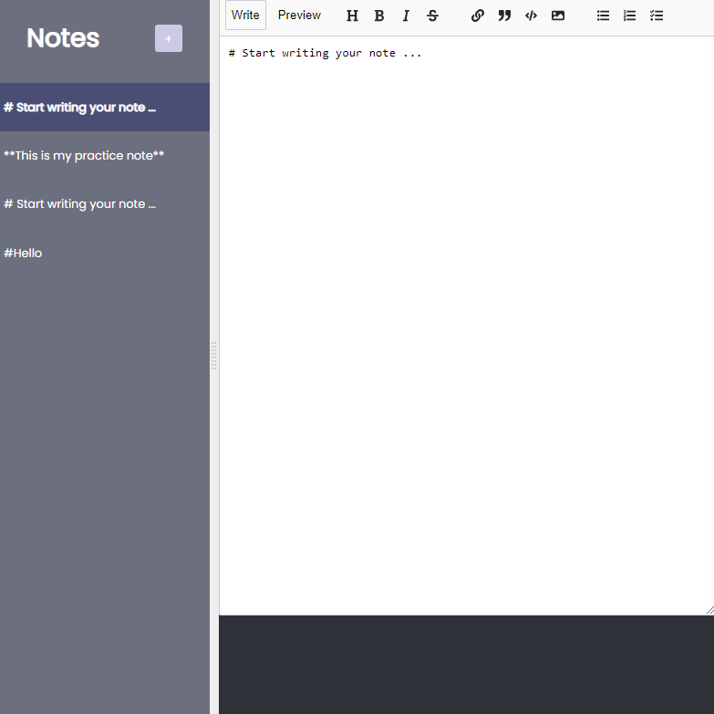

# scrimba-react-notes-app
Created with CodeSandbox

## Table of contents

- [Overview](#overview)
  - [The challenge](#the-challenge)
  - [Screenshot](#screenshot)
  - [Links](#links)
- [My process](#my-process)
  - [Built with](#built-with)
  - [What I learned](#what-i-learned)
  - [Useful resources](#useful-resources)

## Overview
Created a notes webpage with React

### The challenge

Users should be able to:

- Add new notes to the notes webpage
- Delete notes
- Notes that are being edited will move to the top of the page

### Screenshot

### Links

- Solution URL: https://github.com/Jud1th1/scrimba-react-notes-app
- Live Site URL: https://cartmate-groceryapp.netlify.app/

## My process
- During the development process, I followed a Scrimba tutorial to improve an existing codebase. We added the following features:
- Syncing notes with a Firebase database for data storage and retrieval.
- Implemented note summary titles using the react-split library for a split view between the sidebar and note editor.
- Kept the currently edited note at the top by sorting the notes array based on the updatedAt property.
- Enabled note deletion using the setNotes function and filtering out the note with a matching noteId.
- Throughout the development process, I encountered various challenges. Since the Scrimba tutorial used React 17 and was hosted on a different server, there were instances where I faced errors. Whenever an error occurred, I carefully read the full error message in the console and researched any unfamiliar terms. Most errors were resolved by making minor adjustments, such as adding missing function calls or addressing specific areas pointed out by CodeSandbox. For more complex errors, I relied on search engines, YouTube tutorials, trial and error, and patience to find solutions. 
- Once all the errors were resolved, I decided to make some stylistic changes to the application. The layout itself is very familiar to most note apps so I chose to keep it that way but simply add some color and larger text for readability 

### Built with

- HTML
- CSS
- Javascript
- Firebase/FireStore
- React

### What I learned

-	Integrating Firebase: I gained more experience with connecting my application to a Firebase database. I learned how to perform essential database operations like creating, reading, updating, and deleting data.
-	Working with React Hooks such as useState, useEffect, and useCallback. These hooks allowed me to manage state, handle side effects, and optimize performance in my application.
-	How to use External Libraries
-	Error Handling and Troubleshooting

### Useful resources

- https://scrimba.com/playlist/pYkgpAP
